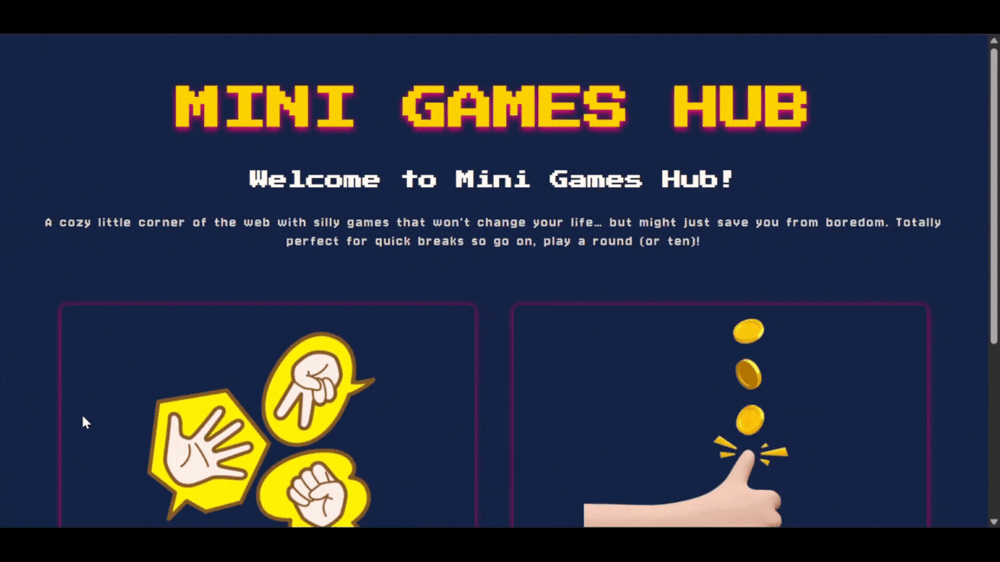

# Mini-Games Hub
A collection of small JavaScript games to practice coding logic, DOM manipulation, and user interaction.

## Features
-	Multiple mini-games in one hub (growing collection).
-	Simple, responsive UI for easy play.
-	Persistent score tracking using localStorage.

## Available Games
-	**Rock-Paper-Scissors** - Classic hand game vs. the computer.
-	**Heads or Tails** - Guess heads or tails and track your scores.

## Tech Stack
-	**Languages:** JavaScript, HTML5, CSS3
-	**Tools:** Visual Studio Code, Git & GitHub

## Demo


## How to Play
1.	Clone the repository.
```bash
git clone https://github.com/blnstrixie/mini-games-hub.git
```
2.	Open the game `index.html` file in your browser.
3.	Pick a game from the hub and start playing.

## Current Status
This project is actively being updated as I learn and add new games.

## Planned Features
-	Polish UI/UX.
-	Add sounds and animations for a more engaging experience.
-	Add high score tracking.
-	Make all games mobile-friendly.